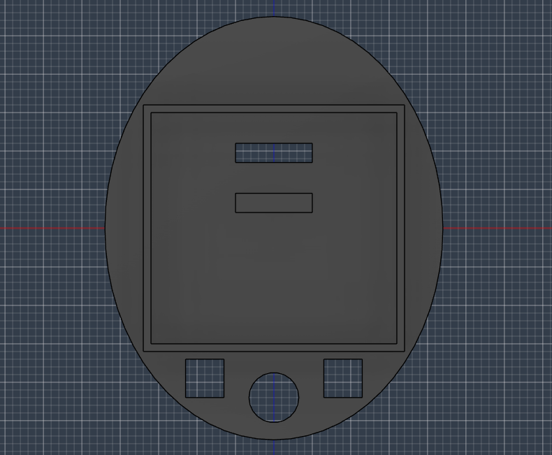
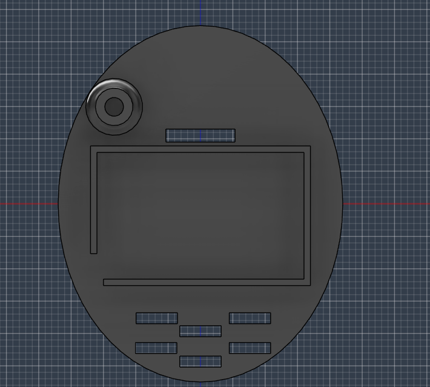
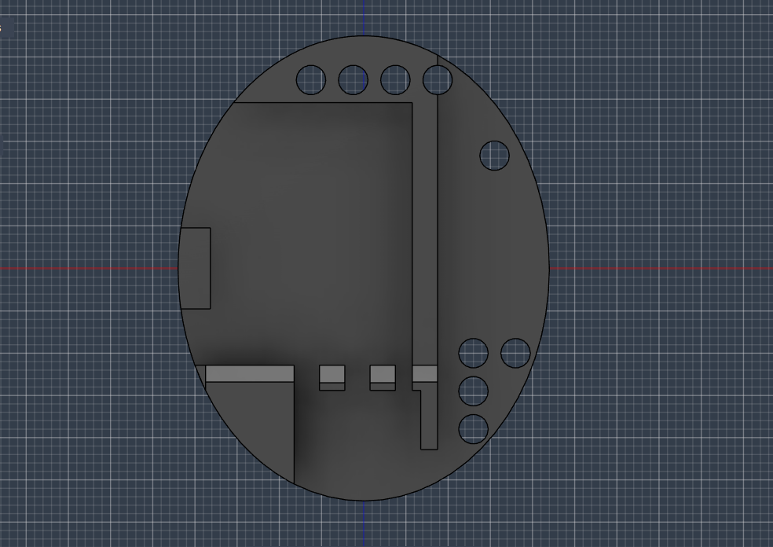
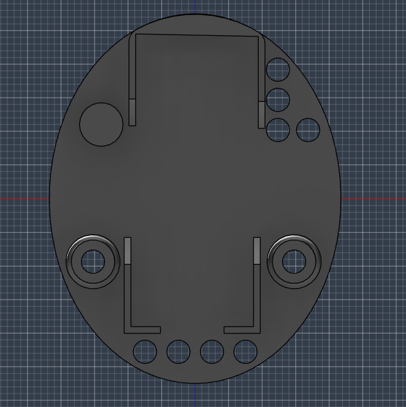
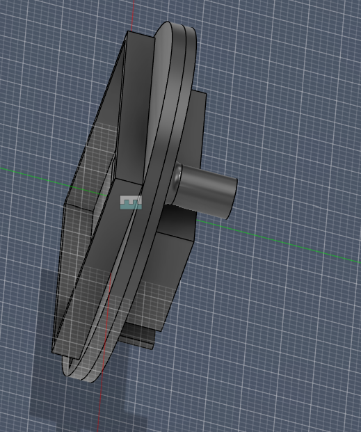
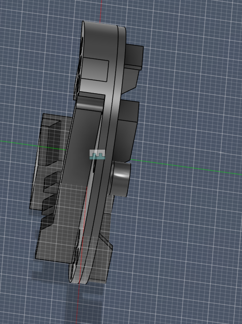

# Tamagotchi
This is a Tamagotchi Created by me for fun and experiment. This uses Arduino Nano as the Processor. I have also created a Basic 3D Model for this Project.

## Required Electronics
 - Ardunino Nano x 1
 - 300mah Battery x 1
 - Charging module x 1
 - 128X64 OLED Display x 1
 - Push Buttons x 3
 - Slide Switch x 1

## 3D Model Instructions

There are 4 Panels for the 3D Model. Firstly, We attach the Panel 1 and Panel 2 Together with Glue. Then we attach the Panel 3 and Panel 4 together with Glue. Then We attach the components inside them according to the cutouts Like Panel1 is for Oled Display, Panel 2 is for Battery , Panel 3 is for charging module and Panel 4 is for Arduino Nano. Wire them together according to the schmatics and upload the code to the Arduino Nano.

### Panel 1

### Panel 2

### Panel 3

### Panel 4

### Panel1 and Panel2 Glued Together

### Panel3 and Panel4 Glued Together

